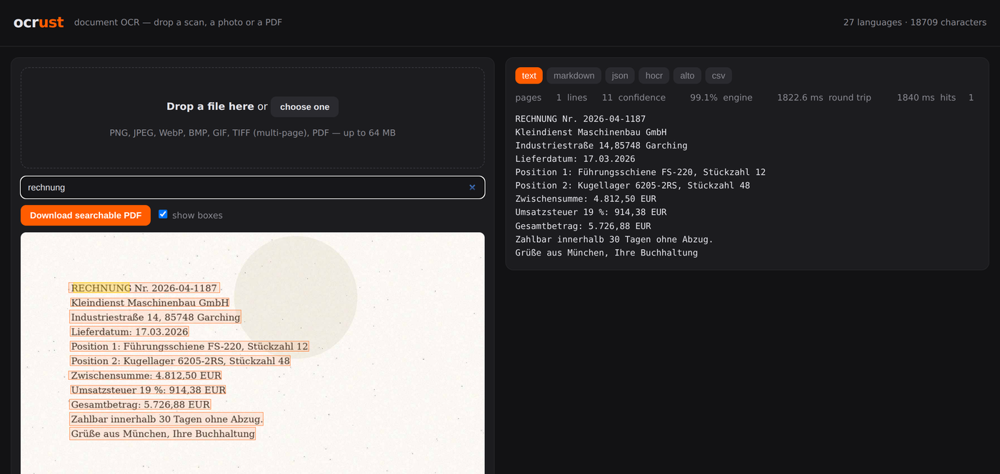

# Examples

## `app.py` — the test application

A local web app for trying the library out: drop a scan, a photo or a PDF into
the browser and see what comes back.

```bash
pip install "ocrust[models]"
python examples/app.py                       # http://127.0.0.1:8765
python examples/app.py --port 9000 --lang de,fr --dpi 300
```



**No dependencies.** Only the standard library and `ocrust` itself — no Flask, no
FastAPI, no Streamlit. If the app runs, the library runs, which makes it a
reasonable smoke test for an installation.

What it shows:

| | |
|---|---|
| Recognized text | with every export format side by side: text, Markdown, JSON, hOCR, ALTO, CSV |
| Line boxes | drawn over the image, so you can see what the detector found |
| Search | `doc.search()` server-side; hits are highlighted in the overlay |
| Confidence | mean line confidence and per-page timing |
| Searchable PDF | one button: a PDF keeps its own pages and gains a text layer, an image becomes a new PDF |
| Languages | what the loaded model covers, from `/languages` |

Options: `--host`, `--port`, `--lang`, `--dpi`, `--models`, `--workers`.

### As an HTTP API

The endpoints are plain HTTP, so the app doubles as a tiny OCR service for
scripts:

```bash
# JSON with text, boxes, confidences and every export
curl -s -F file=@invoice.pdf http://127.0.0.1:8765/scan | jq '.exports.text'

# the same, with search hits
curl -s -F file=@invoice.pdf 'http://127.0.0.1:8765/scan?q=gesamtbetrag' | jq '.matches'

# a searchable PDF
curl -s -F file=@scan.pdf http://127.0.0.1:8765/pdf -o scan.ocr.pdf

# raw body instead of multipart
curl -s --data-binary @page.png -H 'X-Filename: page.png' \
     http://127.0.0.1:8765/scan | jq '.confidence'

curl -s http://127.0.0.1:8765/languages | jq '.languages | length'
curl -s http://127.0.0.1:8765/health
```

`POST /pdf` also returns an `X-Ocrust-Report` header with the page counts, so a
PDF that already contained text is recognizable as "nothing added" rather than
looking like a failure.

### What it is not

A production service. It binds to localhost, keeps one engine for all requests,
holds uploads in memory (64 MB ceiling) and has no authentication, no rate
limiting and no queue. For a real deployment, put the same three calls —
`scan`, `search`, `ocr_pdf` — behind whatever framework you already run.

It is covered by `tests/test_example_app.py`, which starts the server on an
ephemeral port and posts real files to it, so the example cannot quietly rot.
